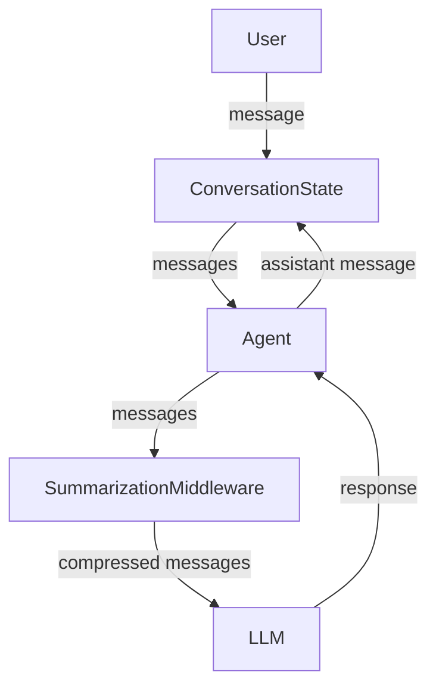

# AI Architecture Case Study: Stateful LLM Agent with Cost-Aware Memory

**Author:** Ravi Chikka  
**Role Focus:** AI Architect / AI Systems Engineer  
**Background:** Senior Data Engineer transitioning into AI Architecture  

---

## Executive Summary

This project demonstrates the design of a **stateful, cost-aware AI agent system** built on top of modern LLM APIs.  
The core architectural challenge addressed is **long-running conversational state** under strict token and cost constraints.

Rather than treating the LLM as a magical black box, this system treats it as an **unreliable, probabilistic component** inside a larger distributed system.

Key architectural decisions include:
- Explicit ownership of conversation state
- Stateless agents with caller-managed memory
- Middleware-based summarization to control context growth
- Model abstraction for provider swap-ability
- Debug and observability hooks at the model boundary

---

## Problem Statement

LLMs have a finite context window and non-linear cost characteristics.  
Naively appending all conversation history leads to:

- Token explosions
- Increased latency
- Silent cost overruns
- Eventual loss of important early context

The problem:  
**How do we build a long-running AI agent that remembers what matters, forgets what doesn’t, and remains cheap and predictable at scale?**

---

## Architectural Goals

1. **Explicit state ownership** – no hidden memory
2. **Cost predictability** – bounded token growth
3. **Model swap-ability** – no vendor lock-in
4. **Observability** – inspect prompts and summaries
5. **Failure containment** – graceful degradation

---

## High-Level Architecture

### Mermaid Diagram

---

## Component Breakdown

### 1. Conversation State (Caller-Owned)

- Stored as an append-only list of messages
- Passed into every agent invocation
- Single source of truth for memory
- Enables replay, inspection, and persistence

**Key Insight:**  
Agents do not own memory. Callers do.

---

### 2. Agent (Stateless Executor)

- Executes a single step given messages
- No internal memory
- Easy to test, scale, and reason about

This avoids hidden state and makes behavior deterministic *given inputs*.

---

### 3. Summarization Middleware

- Monitors token growth
- Triggers summarization when thresholds are exceeded
- Replaces older messages with a semantic summary
- Keeps recent messages verbatim

**Why middleware?**
- Keeps summarization orthogonal to agent logic
- Enables reuse across agents
- Makes memory compression a pluggable concern

---

### 4. Model Abstraction Layer

- Wraps the underlying LLM
- Adds debug logging for final prompts
- Preserves provider-agnostic interfaces

This allows:
- Model swapping (OpenAI, Anthropic, etc.)
- Cheap models for summarization
- Stronger models for reasoning

---

## Memory Strategy

This system uses **hybrid memory**:

- **Short-term memory:** recent messages (verbatim)
- **Long-term memory:** summarized conversation state

This mirrors human cognition:
- Exact recall for recent context
- Compressed semantic memory for older context

---

## Cost Control Strategy

- Hard token thresholds for summarization
- Cheap model for summarization tasks
- Single entry point (`send()`) to prevent accidental stateless calls

This design prevents unbounded growth and silent cost escalation.

---

## Observability & Debugging

The system includes:
- Prompt inspection at the model boundary
- Summary extraction from message streams
- Deterministic replay of conversations

This enables:
- Debugging hallucinations
- Understanding why a model responded a certain way
- Auditing AI behavior

---

## Failure Modes & Mitigations

| Failure Mode | Mitigation |
|-------------|-----------|
Context overflow | Summarization middleware |
Model forgetfulness | Explicit state passing |
Cost explosion | Token thresholds |
Hidden behavior | Debug model wrapper |
Vendor lock-in | Model abstraction |

---

## What Makes This an AI Architecture Project

This is **not** a chatbot demo.

It demonstrates:
- Explicit orchestration
- Clear state ownership
- Cost-aware design
- Provider-agnostic modeling
- Production-style thinking

---

## CV / Portfolio Positioning

**Suggested CV Bullet:**

> Designed and implemented a stateful, cost-aware AI agent architecture using LLMs, featuring explicit memory management, summarization middleware, model abstraction, and observability for long-running conversations.

**Interview Talking Points:**
- Why agents should be stateless
- Why middleware should not own memory
- How to control LLM cost at scale
- How to design for model churn

---

## Confluence / Notion Version

This document maps cleanly to:
- **Architecture Overview**
- **Design Decisions**
- **Trade-Offs**
- **Remediation & Future Work**

Each section can be copied directly into internal documentation tools.

---

## Future Improvements

- Persist conversation state in Redis / Postgres
- Add vector memory for retrieval
- Introduce model routing based on intent
- Integrate evaluation and drift detection

---

## Final Takeaway

LLMs are not deterministic services.  
They are probabilistic components that must be **architected around**.

This project demonstrates how data engineering principles translate directly into effective AI architecture.
